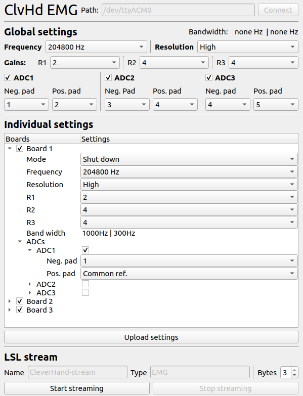

# CleverHand configuraton GUI
Simple Graphical interface to configurate a CleverHand master and stream EMG samples. 

# GUI
<div style="filter: drop-shadow(0px 3px 10px rgba(0,0,0,0.22)); max-width: 500px">

</div>

# Building source code
To build the project run:
```bash
cd qt-clvhd-config
mkdir build && cd build
cmake .. && make
```

# Demonstration app
When the project have been built, you can run:
```bash
./qt-clvhd-config -h
```
to get the demonstration app usage.

# Example
Open the  file to get an example how to use the lib.
